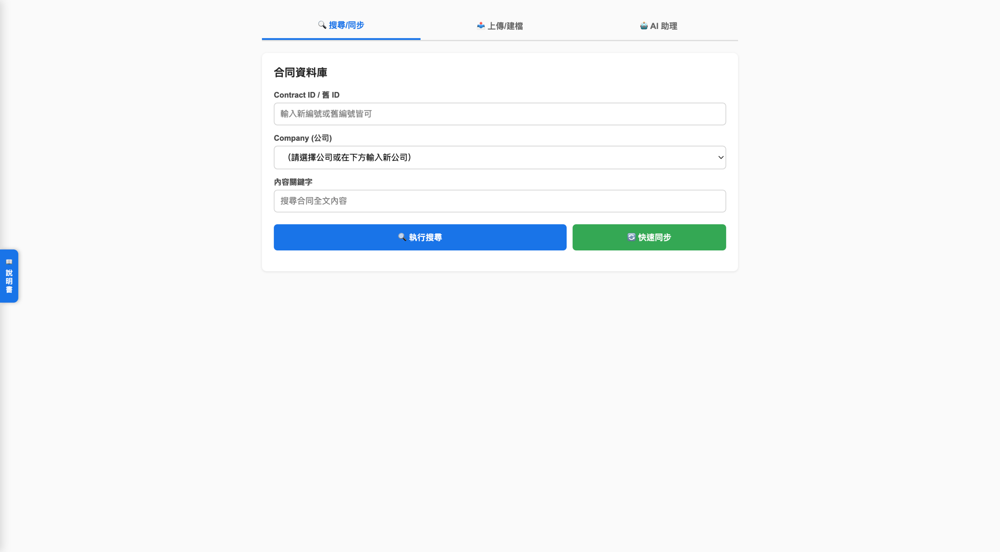
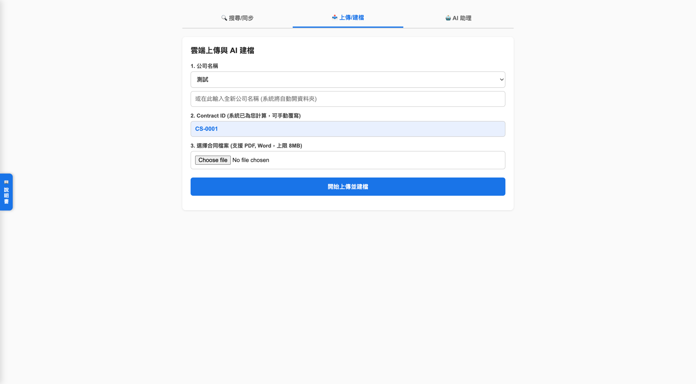
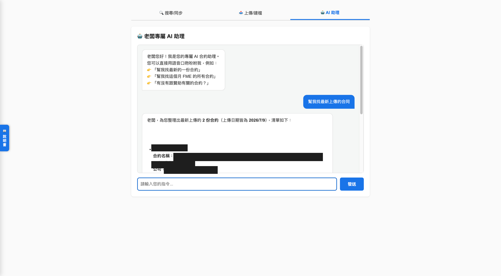

### Internal tool — no public demo (operates on live company contract data)

---

## Project Overview

This project is an **internal contract management system** built independently as a personal work output for my employer between **June 2026 and July 2026**, currently in active use.

The system replaces a manual folder-and-spreadsheet workflow with a password-protected web application for uploading, indexing, and searching company contracts, plus an AI assistant that answers natural-language questions grounded in the contract text itself. It runs entirely on Google Workspace — Apps Script as the backend, Sheets as the database, Drive as file storage — so there is no server to host or pay for.

Built solo end to end: architecture, RAG pipeline, AI integration, frontend UI, and deployment.

---

## Approach & Methods

- **Storage & Database:**
  - Contracts stored in Google Drive, organized into per-company folders created automatically on first upload
  - Google Sheets used as the database across three tables: a main index, a hidden full-text store (`_FullTextData`), and a company-to-code map (`_CompanyMap`)
  - Text extracted from PDF and Word files by converting each to a temporary Google Doc via the Drive API and reading the body, then trashing the temp file

- **Retrieval (RAG):**
  - Two-layer local retrieval runs before any AI call, so the model only ever sees relevant contracts
  - Layer 1 matches query keywords against structured fields (Contract ID, company, year, legacy ID)
  - Layer 2 matches against the full extracted text of every contract
  - The union of both layers is capped at 5 contracts x 1500 characters and passed to Gemini as context; the model is instructed to return each contract as a clickable Drive link

- **Auto Contract ID:**
  - Company codes derived from name initials, with Chinese pinyin-initial support and automatic collision resolution
  - Per-company sequential numbering (`FME-0001`, `FME-0002`) computed from the existing index
  - Next ID previewed live in the upload form before the file is submitted, and overridable by hand

- **Web Interface:**
  - Full HTML/CSS/JS UI served from a single Apps Script `doGet()`, embeddable in an iframe on the company site
  - Three tabs: Search/Sync, Upload/File, AI Assistant, behind a password gate
  - Slide-out documentation panel sized with `calc()` to occupy only the empty left gutter, so it never overlays the main content

---

## Technical Challenges

- **Working within a 6-minute execution ceiling:** Apps Script kills any function that runs past six minutes, but backfilling legacy IDs across the full archive requires one AI call per contract plus rate-limit backoff — far beyond that budget. Designed the backfill as a resumable incremental job: it writes each cell immediately rather than batching at the end, skips any row already filled, and exits cleanly at 4.3 minutes with a progress log. Re-running it simply picks up where it stopped, so an arbitrarily long job completes across however many runs it needs, and a mid-run failure never loses completed work.

- **Near-zero Gemini quota on a corporate Workspace account:** The account returned HTTP 429 with a quota limit of 0 for most models, and 404 for others. Wrote a diagnostic that probes each candidate model independently and logs status plus error body, which isolated `gemini-flash-latest` as the only model the account could actually reach — a fact no error message stated directly. Since that model carries a 20-request/day free tier, the RAG pre-filter became a hard requirement rather than an optimization: sending the whole archive per query was never viable.

- **Google Sheets as a database under read pressure:** Full-text search reads every contract's extracted text, which meant re-pulling the entire hidden sheet on each query and on every backfill row. Cached the full-text map in `CacheService` with a 5-minute TTL, collapsing repeated full-sheet reads within a session down to one.

---

## Key Features

- Multi-condition search across Contract ID (current or legacy), company, and full contract text
- One-click Drive sync that indexes newly added files and prunes trashed ones in a single pass
- Upload with automatic ID assignment and AI-extracted legacy contract number
- AI assistant with two-layer RAG retrieval, returning clickable Drive links to matched contracts
- Spreadsheet menu tools for sync, resumable legacy-ID backfill, and cleanup of deleted records
- Built-in slide-out user manual covering Drive layout, sheet schema, and every UI action
- Local Python scripts for bulk classification and inventory of the existing archive prior to import

---

## Tools & Technologies

- **Backend:** Google Apps Script (serverless)
- **Frontend:** HTML / CSS / JavaScript (embedded, no framework)
- **Database:** Google Sheets (Sheets API v4)
- **File Storage:** Google Drive (Drive API v3)
- **AI:** Google Gemini (`gemini-flash-latest`)
- **Text Extraction:** Drive-side conversion to Google Docs
- **Caching:** Apps Script CacheService (5-minute TTL)
- **Local Preprocessing:** Python, pdfplumber, python-docx, openpyxl

---

## Project Structure

```
contract-management-system/
├── ContractSystem_v2.gs        Apps Script application (single-file deployment)
├── classify_by_content.py      Local: classify unindexed contracts by content keyword
├── process_contracts.py        Local: batch scan PDF/Word files and export an Excel inventory
├── requirements.txt
└── README.md
```

Apps Script deploys as a flat file, so `ContractSystem_v2.gs` is organized into sections:

```
ContractSystem_v2.gs
├── Config                      Drive/Sheet IDs, password, API key
├── Helpers
│   ├── getCodeMap()            Company to code map, seeded on first run
│   ├── generateUniqueCode()    Initials-based code with collision resolution
│   ├── getChineseInitial()     Pinyin initial for Chinese company names
│   └── buildSeqMap()           Highest sequence number per company code
├── AI
│   ├── testGeminiApi()         Diagnostic: probe each model, log status
│   ├── aiExtractOldId()        Extract legacy contract number from text
│   └── chatWithAI()            Two-layer RAG retrieval, then Gemini call
├── Web app
│   ├── doGet()                 Serves the full UI (tabs, manual panel, password gate)
│   ├── checkPassword()         Password gate
│   ├── searchContractsWeb()    Multi-condition search
│   ├── uploadFileWeb()         Upload, extract, AI-tag, index
│   ├── getPreviewContractId()  Live next-ID preview
│   └── syncAllWeb()            Sync entry point for the web UI
├── Sync
│   ├── scanAndFillContracts()  Index new Drive files
│   ├── scanFolderRecursive()   Recursive walk with time budget
│   ├── removeDeletedFiles()    Prune trashed files from both sheets
│   └── backfillOldContractIds()  Resumable AI backfill of legacy IDs
└── onOpen()                    Spreadsheet menu registration
```

---

## Screenshots

**Search / Sync** — multi-condition search with one-click Drive sync



**Upload / File** — auto-assigned Contract ID previewed before upload



**AI Assistant** — natural-language query with RAG retrieval, returning structured results and clickable Drive links (contract details redacted)



---

## Deployment

1. Open [Google Apps Script](https://script.google.com) and create a new project
2. Paste the contents of `ContractSystem_v2.gs` into the editor
3. Fill in the four config variables at the top of the file:

```javascript
var ROOT_FOLDER_ID = 'YOUR_GOOGLE_DRIVE_FOLDER_ID';
var SHEET_ID       = 'YOUR_GOOGLE_SHEET_ID';
var SITE_PASSWORD  = 'YOUR_SITE_PASSWORD';
var GEMINI_API_KEY = 'YOUR_GEMINI_API_KEY';  // https://aistudio.google.com/apikey
```

4. Under **Services**, add Drive API v3 and Sheets API v4
5. Deploy via **Deploy > New deployment > Web app**, with access set to "Anyone"

The hidden `_FullTextData` and `_CompanyMap` sheets are created automatically on first run.

> Apps Script serves the deployment version, not the editor's current code. After any edit, redeploy with **Manage deployments > Edit > Version > New version** — reusing the existing version leaves the live URL running the old code.

To enable the spreadsheet menu tools, bind the same file to the target sheet via **Extensions > Apps Script**.

---

## Local Preprocessing Scripts

```bash
pip install -r requirements.txt
python process_contracts.py       # Scan a local folder, export an Excel inventory
python classify_by_content.py     # Classify unindexed files by content keyword
```
